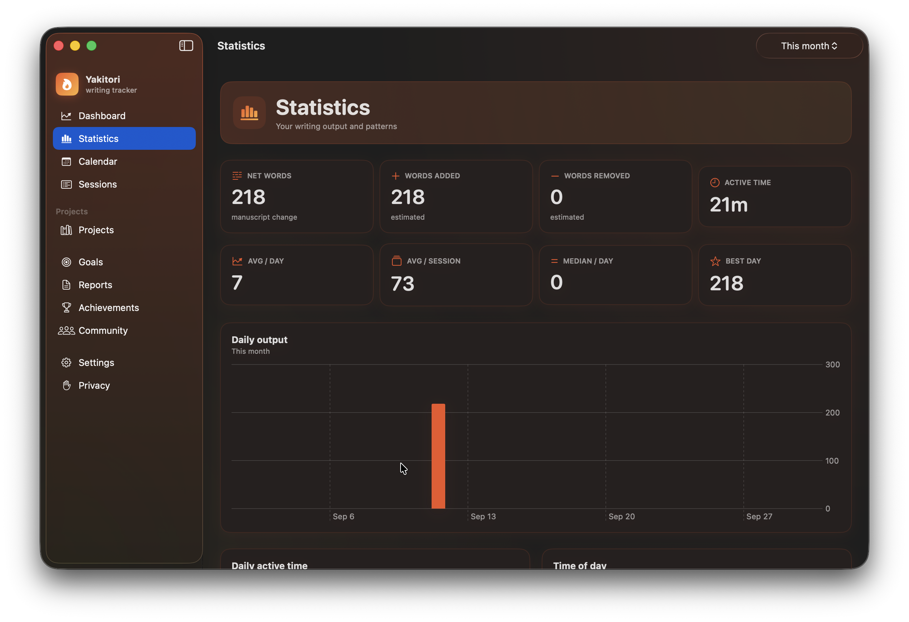
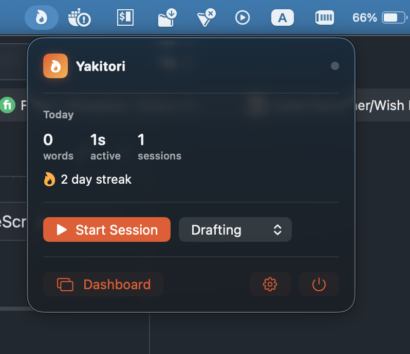

# Yakitori

A native macOS writing analytics and session tracker. It observes writing activity
in the applications you already use, associates it with projects, records
statistics, and presents analytics — **without ever recording the words you type**.

> Track the writer, not the writing.

This repository implements the product described in
[`docs/DESIGN_DOCUMENT.md`](docs/DESIGN_DOCUMENT.md).

It also contains the commercial platform (accounts, commerce, licensing, social,
and leaderboards) under [`website/`](website/). The platform is additive: the
macOS app remains local-first and never requires the network to track writing.
See [`docs/`](docs/) for the platform architecture and operations documentation.

Repository: https://github.com/islonely/yakitori

---

## Screenshots

Dashboard and statistics:



Menu bar quick menu:



---

## Application support

Only **Microsoft Word** and **Apple Pages** can provide an exact word count,
because they expose a scripting (AppleScript) interface we can query. Every other
application is tracked for **time and focus only** and shows "Word count
unavailable" rather than a guess. Yakitori never estimates words from keystrokes
and never reads document, sheet, or project files to manufacture a count.

### Word-count applications

| Application | Mechanism |
|---|---|
| Microsoft Word | AppleScript `compute statistics` |
| Apple Pages | AppleScript `count of words of body text` |

### Time-only applications

| Application | Why there is no word count |
|---|---|
| Scrivener | No scripting API (confirmed by the developers) |
| Ulysses | x-callback API exists but exposes no count and cannot identify the active sheet |
| LibreOffice | UNO `getWordCount` needs an enabled socket/macro bridge, not a supported macOS automation API |
| Obsidian | Electron; no AppleScript, and counting would mean reading the vault |
| Chrome / Brave / Edge / Safari | JavaScript from Apple Events is off by default; Google Docs renders to canvas |
| Lacuna Book Formatter | Internal `get_word_count` only; no external API, URL scheme, or AppleScript |

Any other application can still be added and tracked for time and focus.

---

## Highlights

- **Menu bar utility** that keeps tracking while the dashboard window is closed.
- **Background tracking engine** independent of the SwiftUI layer.
- **Only real writing is recorded**: for apps with a word count (Word and Pages),
  a session where the word count does not change is discarded, so idle time never
  inflates your history. Apps without a word count (for example Scrivener,
  Obsidian, or a browser) are still tracked by active and focus time.
- **Configurable global hotkey** to start/stop a session from anywhere (Settings →
  Tracking).
- **Session state machine** (`IDLE → FOCUSED → ACTIVE → PAUSED → ACTIVE → ENDED`)
  with pause/resume, inactivity timeout, sleep/wake handling and crash recovery.
- **Frontmost application detection** and **activity detection via the system
  idle counter** (no keyboard or mouse events are observed at all, and no
  permission is needed).
- **Word & Pages adapters** using AppleScript (verified against Word for Mac 16.x
  and Pages on macOS 26) for active document, path and exact word count. Word
  counts are sampled only during a pause in typing, never mid-keystroke.
- **Adapter architecture** (`WritingApplicationAdapter`) so new integrations can be
  added without touching the tracking engine.
- **Local-first SQLite persistence** behind a `Database` abstraction and
  repositories, with versioned migrations.
- **Statistics engine** for daily/weekly/monthly/yearly/lifetime totals, streaks,
  goals, productivity patterns and completion projections.
- **Full GUI**: dashboard, statistics, calendar heatmap, sessions, projects,
  goals, reports, achievements, community, settings and a Permission Center.
- **A deep chart set**: rolling averages with 7/30-day trends, this-week vs
  last-week momentum, a 7x24 day/hour heatmap, a radial 24-hour "writing clock",
  session efficiency scatter, pace trend and distribution, focus vs active
  stacks, project mix, session-type stacks, streak history, added vs removed,
  personal records, projection cones, burn-down, per-document history, milestone
  timelines, project comparison, and a months-by-years grid.
- **Advanced analytics**: session-duration and daily-output distributions,
  productivity by session length and by work type, goal performance history,
  project velocity, writing cadence (time between sessions), project effort by
  phase, cumulative lifetime output, and rolling output variability. All reuse
  the existing definitions and are covered by unit tests.
- **CSV/JSON export**, verified database backups, and safe destructive operations.
- **Privacy by design**: no manuscript text, keystrokes, clipboard, or screenshots.

---

## Requirements

- macOS 13 or later
- Xcode 15+ / Swift 5.9+ toolchain
- The Swift package has **no third-party dependencies** (SQLite is a system library).

## Build & run

```bash
# Build and test the core library and app
swift build
swift test

# Build a launchable .app bundle (recommended for permissions/login item)
./Scripts/build-app.sh release
open dist/Yakitori.app
```

Yakitori is a menu bar utility (`LSUIElement`), so it has no Dock icon until the
dashboard is open. Click the flame icon in the menu bar to open the popover, then
**Dashboard**.

### App icon

The bundle icon is generated from `Packaging/Yakitori-Source.png` (a 1024x1024
PNG whose macOS rounded-square shape is already applied, with transparent
corners):

```bash
./Scripts/make-icon.sh        # writes Packaging/Yakitori.icns
./Scripts/build-app.sh release
```

Replace `Packaging/Yakitori-Source.png` with your own 1024x1024 artwork and
re-run. If the source PNG is missing, a programmatic placeholder is rendered.
`CFBundleIconFile` in `Packaging/Info.plist` names the resource.

The database lives at:

```
~/Library/Application Support/Yakitori/Yakitori.sqlite
```

Backups are written to `.../Yakitori/Backups/`.

---

## macOS permissions

Permissions are requested progressively and only when a feature needs them.
Nothing is bypassed, and every feature degrades gracefully.

| Capability | Permission | If denied |
|---|---|---|
| Activity + focus tracking | **None** | Works without any permission; activity is inferred from the system idle counter |
| Word/Pages document + word count | Automation (Apple Events) | Sessions and focus/activity still work; document word counts are unavailable |
| Specific file/folder access | Files & Folders (via `NSOpenPanel`) | Only that specific feature is disabled |
| Notifications | Notifications | Requested only when you enable notifications |
| Launch at Login | Login Items (`SMAppService`) | Start the app manually |

**Accessibility is never requested.** The app does not observe keyboard or mouse
events; it polls the system idle counter, which needs no permission.

Full Disk Access, Screen Recording, Camera, Microphone, Location, and
Accessibility are **never** requested.

### Notes on development builds

The bundle is ad-hoc signed by `Scripts/build-app.sh`. Rebuilding changes the
signature, so macOS may ask you to re-grant Automation permission after a
rebuild. This is expected during development.

---

## Architecture

```
SwiftUI UI  →  AppState  →  Services  →  Repositories  →  SQLite
                                  │
                  ┌───────────────┼────────────────┐
                  ▼               ▼                ▼
           TrackingEngine   StatisticsService   PermissionManager
                  │               │
           Activity events   Aggregates
                  │               │
                  └───────┬───────┘
                          ▼
                 Repositories / Database
                          │
                  Application Adapters
              (Word, Pages = exact counts; others time-only)
```

- `Sources/WritingTrackerCore` — models, persistence, repositories, services,
  statistics, tracking engine, permissions, adapters. **No SwiftUI.**
- `Sources/WritingTrackerApp` — SwiftUI UI, `AppState`, `AppDelegate`, theme.
- `Tests/WritingTrackerCoreTests` — unit/integration tests using isolated
  in-memory or temporary databases.

Key design rules enforced by the code:

- The tracking engine never depends on SwiftUI and keeps running when the window
  closes.
- The UI never touches SQLite directly.
- Application-specific behaviour lives only in adapters.
- Net manuscript change is never labelled "words written".
- `wordsAdded` / `wordsRemoved` are `nil` unless reliable edit-level data exists.
- Word counts are never estimated from keystrokes.
- All statistics are derived from raw sessions and can be rebuilt.

---

## Data model

`WritingApplication`, `Project`, `Document`, `Session`, `ActivityEvent`,
`WordCountSnapshot`, `DailyAggregate`, `Goal`, `Milestone`, `WritingSchedule`,
`AssociationRule`, `UserSettings`.

Timestamps are stored as absolute epoch seconds and all day boundaries are
computed through a timezone-aware `CalendarContext`, so midnight, DST and
timezone changes are handled correctly. Sessions store exact active/focus ranges
so multi-day sessions are split accurately.

## Testing

```bash
swift test
```

Coverage includes: session state transitions, inactivity, sleep/wake, manual and
automatic modes, word-count semantics, daily aggregation across midnight and DST,
crash recovery, repository persistence, association rules, manual entry,
statistics (daily/weekly/monthly/yearly/lifetime/streaks/projections/patterns),
export, backup, and destructive-operation safety.

## Known limitations

- Exact word counts are available for **Word and Pages** only. Scrivener, Ulysses,
  LibreOffice, Obsidian and browsers are tracked for focus/activity time and report
  "Word count unavailable".
- Pages counts come from `body text`, so headers, footers and text boxes are not
  included; the script enumerates the document and can be slower on very large files.
- `wordsAdded`/`wordsRemoved` are only populated for manual entries because Word
  and Pages expose net word count, not edit-level deltas.
- The tracking engine runs in-process with the menu bar app (which keeps running
  when the dashboard is closed) rather than as a separate XPC/LaunchAgent.
  The engine is GUI-independent and the boundary would allow extracting it later.
- Automatic project inference is rule-based as documented; no ML inference.
- **Activity is inferred from the system idle counter** polled every couple of
  seconds, so active-time granularity is a few seconds. No keyboard or mouse
  events are observed.
- **Word counts are sampled during pauses** (or at session boundaries), not while
  you type, so a writing app is never interrupted mid-keystroke. An ending count
  is captured at the pause before a session ends.
- **Typing pace (WPM) is derived** from growth in a document's character count
  (5 characters = 1 word). Deletions and modifier keys add nothing, but pasted
  text counts, and it only exists for Word/Pages sessions where character counts
  are available. It is not per-keystroke counting.
- Accounts and lifetime licensing now exist in the `website/` platform, and the
  app signs in from the **Account** screen to start a one-time **14-day free
  trial** or attach a lifetime license. Once entitled, tracking works fully
  offline. Recording new sessions requires an active license or trial; existing
  data always stays viewable and exportable, and nothing local is deleted.
- Cloud sync of writing data, widgets, and AI analysis are intentionally not
  implemented. Writing data is never uploaded; only deliberately public
  aggregate numbers ever can be.
